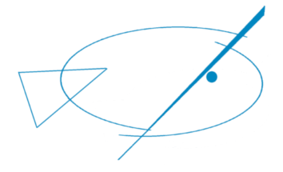
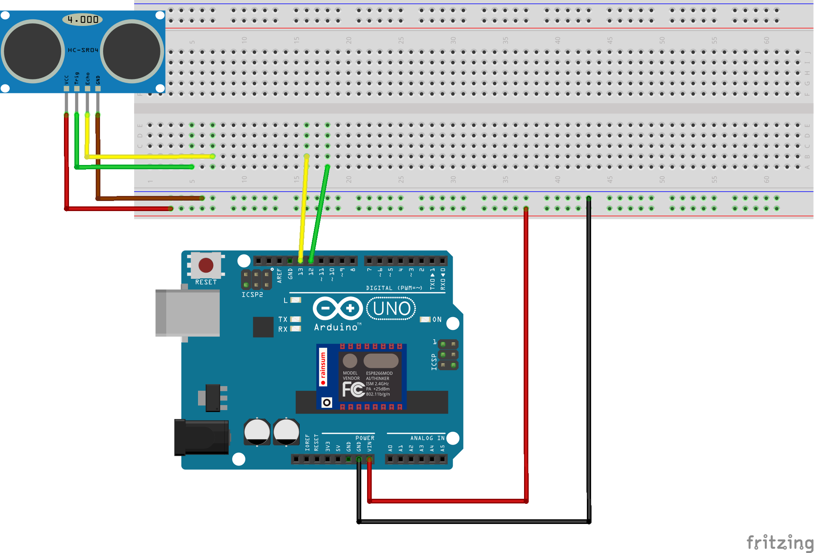

# Berxa Fish Farm Monitoring Solution

This is a project to monitor a fish farm in an automated way.

## [Arduino](arduino)

This folder contains the arduino code for the controller.
Current hardware includes:

- HC-SR04: Ultrasonic sensor to measure distance
- Arduino ESP8266 Shield
- Arduino/Genuino UNO

