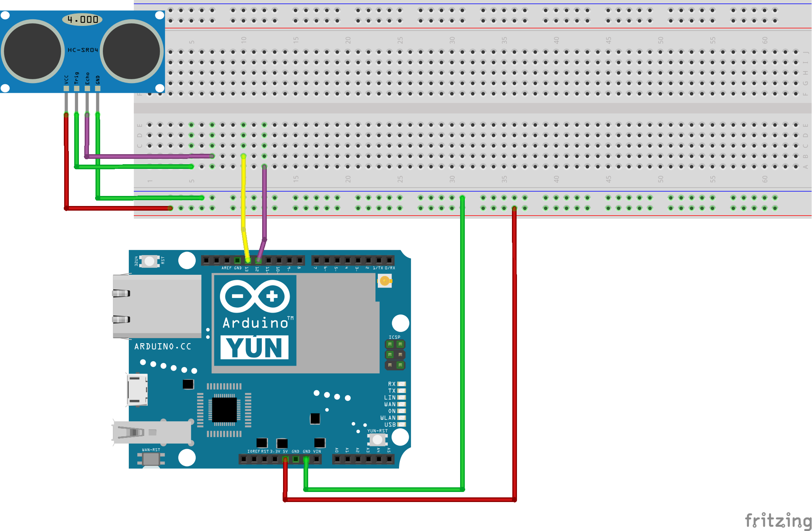

# Berxa Fish Farm Monitoring Solution


This is a project to monitor a fish farm in an automated way.

## [Arduino](arduino)

This folder contains the arduino code for the controller.
Current hardware includes:

- HC-SR04: Ultrasonic sensor to measure distance
- Arduino Yùn



## Password management

[Lastpass](https://lastpass.com/) stores all credentials for the project

## Restore Arduino Yun (restores password)

- Press Wlan-rst for 30+ seconds
- Wait for ~10 minutes
- Connect to the `Arduino YunXXXXX` network
- Access http://arduino.local using the default password for the board
- Configure the Wi-Fi settings

## Deploy the python code to send UDP packages

Use SCP to deploy the `send_udp_package.py`:

```
scp arduino/send_udp_package.py root@arduino.local:/root/
```

## Test 